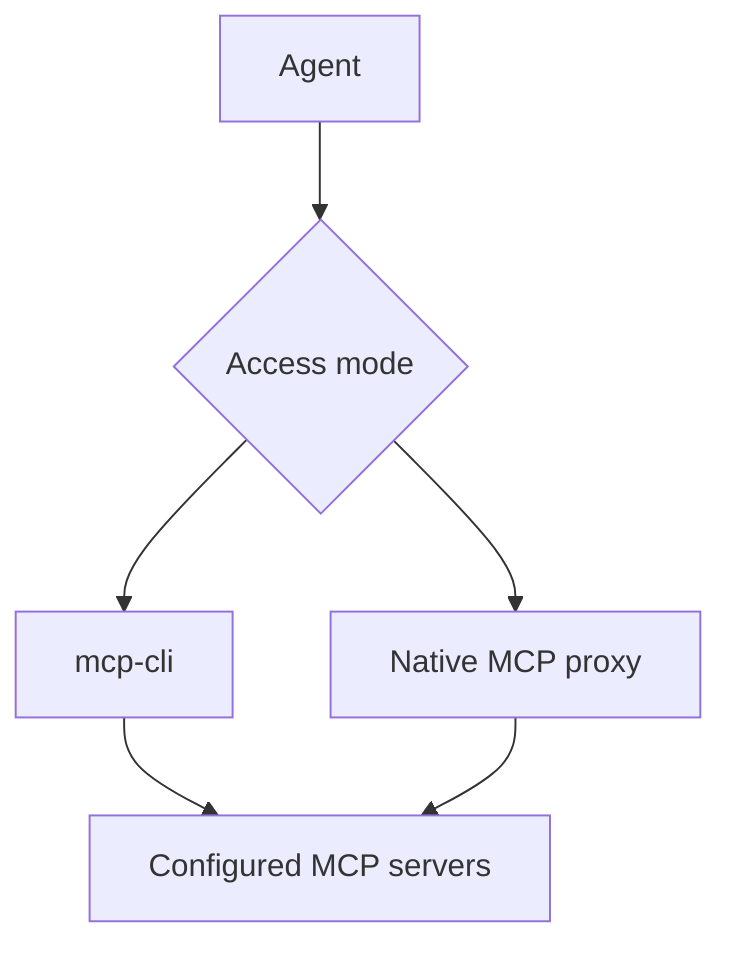

<div align="center">

# 🗜️ MCP Compression Proxy

### More MCP tools. Less context overhead.

Use a large MCP toolset without loading every tool into every prompt. MCP Compression Proxy is a local, open-source gateway with progressive discovery for shell-capable agents and one compatible endpoint for native MCP clients.

[![npm version][npm-version-badge]][npm-package]
[![npm downloads][npm-downloads-badge]][npm-package]
[![Node.js 22+][node-badge]][nodejs]
[![CI][ci-badge]][ci-workflow]
[![codecov][codecov-badge]][codecov]
[![License: MIT][license-badge]][license-file]

[🚀 Quick start](#-quick-start-progressive-discovery) · [🧭 Choose a mode](#-choose-a-mode) · [🔧 Configuration](#-configuration) · [💖 Support](#-support-the-project)

</div>

MCP Compression Proxy combines local stdio and remote Streamable HTTP servers behind one configuration. Agents can search for a tool, inspect its schema only when needed, and keep oversized results out of the conversation.

- 🔍 **Discover tools on demand** with `mcp-cli`.
- 🔌 **Connect through one MCP endpoint** when native MCP compatibility is required.
- 📦 **Keep large results local** and read only the relevant portions.
- ♻️ **Reuse warm backends** and refresh stale or unhealthy connections.
- 🏠 **Keep control local** without a hosted gateway or control plane.

> [!IMPORTANT]
> `mcp-cli` provides the largest context reduction because it defers full tool schemas until an agent requests one. Native proxy mode shortens tool descriptions, but MCP clients still receive each tool's input schema during discovery.

## 🧭 Choose a mode

| Your client                   | Start with                  | Context behavior                                                                  |
| ----------------------------- | --------------------------- | --------------------------------------------------------------------------------- |
| ⌨️ Shell-capable coding agent | **`mcp-cli` (recommended)** | Search compact summaries, inspect one schema, then call the tool                  |
| 🔌 Native MCP client          | **`mcp-compression-proxy`** | Connect through one endpoint and use shorter descriptions; schemas remain exposed |

Both modes use the same server configuration and support local stdio and remote Streamable HTTP backends.

## 🚀 Quick start: progressive discovery

Requires Node.js 22 or newer.

### 1. Install

```bash
npm install -g mcp-compression-proxy
```

The package installs two commands: `mcp-cli` for progressive discovery and `mcp-compression-proxy` for native MCP clients.

### 2. Add one MCP server

This macOS/Linux example gives the filesystem server access to `/tmp`:

```bash
mkdir -p "$HOME/.mcp-compression-proxy"
cat > "$HOME/.mcp-compression-proxy/servers.json" <<'JSON'
{
  "mcpServers": [
    {
      "name": "filesystem",
      "command": "npx",
      "args": ["-y", "@modelcontextprotocol/server-filesystem", "/tmp"]
    }
  ]
}
JSON
```

### 3. Find and call a tool

```bash
mcp-cli doctor
mcp-cli search file
mcp-cli info filesystem/list_directory
mcp-cli call filesystem/list_directory '{"path":"/tmp"}'
```

The daemon starts automatically on the first command and keeps backend connections warm. `doctor` validates the configuration and reports backend health.

### 4. Tell your agent how to use it

Add this to your project instructions or `AGENTS.md`:

```text
Use mcp-cli to access MCP tools. Search before choosing a tool, inspect its
schema before the first call, and read large outputs with `mcp-cli output`
instead of loading an entire payload into the conversation.
```

That is the complete progressive-discovery setup. Add more servers to the same `servers.json` file as needed.

> 🎉 **You're ready.** Your agent can now discover the right tool, load one schema, and call it without carrying the entire catalog through the conversation.

## 🔌 Native MCP client setup

Use this mode when a client expects to launch an MCP server directly. Add the proxy to the client's MCP configuration:

```json
{
  "mcpServers": {
    "compression-proxy": {
      "command": "mcp-compression-proxy",
      "env": {
        "LOG_LEVEL": "info"
      }
    }
  }
}
```

Restart the client after saving its configuration. The proxy loads backend definitions from `~/.mcp-compression-proxy/servers.json` and exposes their tools as `serverName__toolName`, such as `filesystem__read_file`.

### Compress descriptions

If the client supports [MCP sampling][mcp-sampling], ask it to call:

```text
mcp-compression-proxy__compress_via_sampling
```

The proxy asks the client's existing model to shorten a batch of descriptions and saves the results in `~/.mcp-compression-proxy/cache.json`. No separate model provider or API key is required. Sampling is deprecated in the 2026-07-28 MCP specification, so new clients may omit it.

If sampling is unavailable, use `mcp-compression-proxy__get_uncompressed_tools` and then `mcp-compression-proxy__cache_compressed_tools`. Updated backend descriptions are detected as stale and queued for compression again.

## 🧠 Where the context savings come from

| Access pattern   | Loaded before the task                                     | Loaded when a tool is selected             |
| ---------------- | ---------------------------------------------------------- | ------------------------------------------ |
| Eager MCP client | Every advertised name, description, and input schema       | Nothing additional                         |
| Native proxy     | Names, shorter cached descriptions, and every input schema | Full description on request                |
| Progressive CLI  | A small command vocabulary and compact search results      | The selected tool's description and schema |

Exact savings depend on the number of servers, their schema sizes, and which tools a task uses. The project intentionally does not claim a universal percentage: measure the complete tool definitions in your own stack rather than description text alone.

## ✨ What it handles

- **One configuration:** Aggregate any number of local stdio and remote Streamable HTTP servers.
- **Progressive discovery:** Search tools and fetch only the schema needed for the next call.
- **Large-output control:** Store results above a configurable threshold in private local files, then search or page through them.
- **Warm, replaceable connections:** Reuse backend processes while draining old generations without interrupting active calls.
- **Authentication recovery:** Reconnect after configured authentication failures and retry only tools explicitly marked safe.
- **Declarative call chains:** Run dependent MCP calls with JSON Pointer references and no arbitrary shell or JavaScript execution.
- **Operational visibility:** Inspect live server state, connection age, active calls, retries, failures, and compression coverage.
- **Tool policy:** Exclude tools entirely or preserve selected original descriptions with case-insensitive wildcard patterns.

## 🏗️ How it works



`mcp-cli` uses a local daemon so repeated commands are short IPC round trips. Native clients launch the stdio proxy and see one namespaced MCP tool catalog.

## ⌨️ CLI reference

| Command                                           | Purpose                                           |
| ------------------------------------------------- | ------------------------------------------------- |
| `mcp-cli search <query>`                          | Search tool names and descriptions                |
| `mcp-cli info <server>/<tool>`                    | Load the full schema for one tool                 |
| `mcp-cli call <server>/<tool> '<json>'`           | Execute a tool                                    |
| `mcp-cli tools`                                   | List compact summaries for every available tool   |
| `mcp-cli output find <id> <query>`                | Search a cached large output                      |
| `mcp-cli output read <id> [offset] [length\|all]` | Read a bounded page or the remainder of an output |
| `mcp-cli script '<json>'`                         | Run a declarative sequence of calls               |
| `mcp-cli stats`                                   | Show server and compression statistics            |
| `mcp-cli doctor`                                  | Validate configuration and backend health         |
| `mcp-cli daemon status`                           | Show daemon and connection lifecycle state        |
| `mcp-cli daemon logs [-n N] [-f]`                 | Read or follow daemon logs                        |
| `mcp-cli daemon restart`                          | Restart the local daemon                          |

Pass call JSON on stdin when shell quoting becomes awkward:

```bash
echo '{"path":"/tmp/notes.md"}' | mcp-cli call filesystem/read_file
```

Pass `--no-auto-start` when a command should fail instead of starting the daemon.

### Large outputs

Tool results longer than 10,000 characters are stored under `~/.mcp-compression-proxy/payloads/` by default. The CLI returns a payload ID instead of flooding the agent's context:

```bash
mcp-cli output find <payload-id> "needle"
mcp-cli output read <payload-id> 0 10000
mcp-cli output read <payload-id> 10000 all
```

The payload directory is mode `0700` and payload files are mode `0600`. Up to 100 entries are retained by the running process; the oldest are evicted first.

### Declarative call chains

Scripts can run up to 20 sequential MCP calls. A later step may use a prior JSON value through an [RFC 6901 JSON Pointer](https://www.rfc-editor.org/rfc/rfc6901):

```json
{
  "steps": [
    {
      "id": "search",
      "server": "docs",
      "tool": "search",
      "arguments": { "query": "progressive discovery" }
    },
    {
      "id": "read",
      "server": "docs",
      "tool": "read",
      "arguments": {
        "url": { "$ref": "search#/results/0/url" }
      }
    }
  ]
}
```

Scripts stop on the first failed step unless that step sets `continueOnError`. References substitute exact values; they do not transform data.

## 🔧 Configuration

The proxy reads both of these files when present:

- `~/.mcp-compression-proxy/servers.json` for user-level servers and defaults.
- `./servers.json` for project-specific additions and overrides.

Servers and tool patterns from both files are combined. Project-level scalar settings override user-level settings. Configuration changes are watched and healthy backends remain connected when their definitions have not changed.

### Local and remote servers

Each server must define exactly one transport: `command` for local stdio or `url` for Streamable HTTP.

```json
{
  "mcpServers": [
    {
      "name": "filesystem",
      "command": "npx",
      "args": ["-y", "@modelcontextprotocol/server-filesystem", "/tmp"],
      "inheritEnv": false
    },
    {
      "name": "remote-docs",
      "url": "https://mcp.example.com/mcp",
      "headers": {
        "Authorization": "Bearer ${DOCS_TOKEN}"
      },
      "timeout": 30
    }
  ],
  "excludeTools": ["*__delete_*", "*__experimental*"],
  "noCompressTools": ["filesystem__write_file"],
  "cli": {
    "payloadThreshold": 10000,
    "autoStartDaemon": true,
    "daemonLogLevel": "info"
  }
}
```

Remote servers support static headers. The proxy does not perform an interactive OAuth redirect, so use bearer tokens or API-key headers supported by the remote endpoint.

Environment references work in `env` and `headers`:

| Syntax              | Result                                                     |
| ------------------- | ---------------------------------------------------------- |
| `${NAME}`           | Use `NAME`; warn and substitute an empty string when unset |
| `${NAME:-fallback}` | Use `NAME`, or `fallback` when unset or empty              |
| `$${NAME}`          | Preserve the literal text `${NAME}`                        |

Local servers inherit the proxy's environment by default. Set `inheritEnv` to `false` for transport-safe defaults only, or provide an array such as `["HOME", "PATH", "LANG"]`. Explicit values in a server's `env` object always win.

### Core options

| Option                        | Default      | Purpose                                                     |
| ----------------------------- | ------------ | ----------------------------------------------------------- |
| `defaultTimeout`              | `30`         | Backend timeout in seconds; overridable per server          |
| `excludeTools`                | `[]`         | Hide matching `server__tool` names completely               |
| `noCompressTools`             | `[]`         | Always show original descriptions for matching tools        |
| `compressionFallbackBehavior` | `"original"` | Show `"original"` or `"blank"` before compression exists    |
| `inheritEnv`                  | `true`       | Control which environment variables local servers receive   |
| `softMaxConnectionAgeSeconds` | `3600`       | Lazily replace a connection on its next use after this age  |
| `hardMaxConnectionAgeSeconds` | `28800`      | Drain a connection at this age and reopen it on demand      |
| `authErrorPatterns`           | `[]`         | Identify authentication failures in errors or tool results  |
| `authRetryTools`              | `[]`         | Name tools safe to retry once after authentication recovery |
| `cli.payloadThreshold`        | `10000`      | Store larger outputs in private local files                 |
| `cli.autoStartDaemon`         | `true`       | Start the daemon when a CLI command needs it                |
| `cli.daemonLogLevel`          | `"info"`     | Set `debug`, `info`, `warn`, or `error` logging             |

Set either connection age to `0` to disable that policy. Lifecycle and authentication options may also be set per server. Authentication failures always replace the backend generation that produced them, but automatic replay occurs only for names matching `authRetryTools`.

See [`servers.json.example`](servers.json.example) for a complete starting point.

<details>
<summary><strong>🚦 Versioned daemon deployments</strong></summary>

The daemon exposes a contract for a separate stable router to run candidate and active releases on different sockets. Configure each instance with `MCP_DAEMON_SOCKET_PATH`, `MCP_DAEMON_PID_FILE`, `MCP_DAEMON_READY_FILE`, `MCP_DAEMON_LOG_FILE`, and `MCP_DAEMON_RELEASE_ID`.

`MCP_DAEMON_BASE_DIR` selects the shared state root, while `MCP_PAYLOAD_DIR` can preserve payload IDs across a release cutover. When `active-release.json` exists in that root, `mcp-cli` treats the installation as router-managed and refuses to start a legacy daemon on the stable socket.

This allows an external router to canary a candidate, switch new requests atomically, drain calls pinned to the old release, and roll back without terminating in-flight work.

</details>

## 🛡️ Security and privacy

- The proxy runs locally and does not require a hosted control plane.
- Tool inputs and outputs go only to the backend servers you configure; remote backends naturally receive calls addressed to them.
- Large outputs are stored in owner-only files and are retrieved by opaque payload ID, not arbitrary path.
- The daemon's local control socket can execute downstream MCP tools and is kept inside an owner-only directory.
- Use `inheritEnv: false` or an allowlist when a third-party local server should not receive unrelated environment variables.
- MCP Compression Proxy is a transport and lifecycle layer, not a sandbox or authorization boundary. Apply normal trust and permission controls to every backend server.

See [SECURITY.md][security] to report a vulnerability.

## 🩺 Troubleshooting

Start with:

```bash
mcp-cli doctor
mcp-cli daemon status
mcp-cli daemon logs -n 100
```

- After changing daemon-specific settings, run `mcp-cli daemon restart`.
- Clear saved descriptions with `mcp-compression-proxy --clear-cache`.
- Native MCP logs go to stderr so stdout remains valid JSON-RPC.
- A restricted agent sandbox may block the daemon's Unix socket. Grant access to `~/.mcp-compression-proxy/` or run the CLI in the host environment.

## 🤝 Contributing

Found a bug 🐛, have an idea ✨, or want to improve the docs? Contributions are welcome. Read [CONTRIBUTING.md][contributing], follow the [Code of Conduct][code-of-conduct], and run the checks before opening a pull request:

```bash
npm install
npm run typecheck
npm run lint
npm test
```

Additional test guidance is in [`tests/README.md`](tests/README.md).

## 💖 Support the project

Open source grows through the people who try it, share it, and improve it. If MCP Compression Proxy gives your agent some breathing room:

- ⭐ **[Star the repository][stargazers]** so more MCP users can discover it.
- 🐛 **[Report a bug or suggest an idea][repo-issues]** to help shape the roadmap.
- 📝 **[Contribute code or documentation][contributing]**—first-time contributors are welcome.
- 💖 **Sponsor continued development** using any of the options below.

<div align="center">

[![GitHub Stars][stars-badge]][stargazers]
[![Sponsor on GitHub][sponsor-github-badge]][sponsor-github]
[![Buy Me a Coffee][sponsor-coffee-badge]][sponsor-coffee]
[![PayPal][sponsor-paypal-badge]][sponsor-paypal]

**Every star, issue, pull request, and contribution helps. Thank you! 🙌**

</div>

## 📄 License

[MIT](LICENSE) © 2025 KDPA. Built with the [Model Context Protocol TypeScript SDK][mcp-sdk].

---

<div align="center">

[⬆ Back to top](#-mcp-compression-proxy)

Made with ❤️ by KDPA

</div>

<!-- Reference links -->

[npm-version-badge]: https://img.shields.io/npm/v/mcp-compression-proxy.svg
[npm-package]: https://www.npmjs.com/package/mcp-compression-proxy
[npm-downloads-badge]: https://img.shields.io/npm/dm/mcp-compression-proxy
[node-badge]: https://img.shields.io/badge/node-%3E%3D22.0.0-brightgreen.svg
[nodejs]: https://nodejs.org/
[ci-badge]: https://github.com/kdpa-llc/mcp-compression-proxy/actions/workflows/test.yml/badge.svg
[ci-workflow]: https://github.com/kdpa-llc/mcp-compression-proxy/actions/workflows/test.yml
[codecov-badge]: https://codecov.io/gh/kdpa-llc/mcp-compression-proxy/branch/main/graph/badge.svg
[codecov]: https://codecov.io/gh/kdpa-llc/mcp-compression-proxy
[license-badge]: https://img.shields.io/badge/License-MIT-yellow.svg
[license-file]: LICENSE
[repo]: https://github.com/kdpa-llc/mcp-compression-proxy
[stars-badge]: https://img.shields.io/github/stars/kdpa-llc/mcp-compression-proxy?style=social
[stargazers]: https://github.com/kdpa-llc/mcp-compression-proxy/stargazers
[repo-issues]: https://github.com/kdpa-llc/mcp-compression-proxy/issues
[contributing]: CONTRIBUTING.md
[security]: SECURITY.md
[code-of-conduct]: CODE_OF_CONDUCT.md
[sponsor-github-badge]: https://img.shields.io/badge/Sponsor-GitHub%20Sponsors-ea4aaa?logo=github
[sponsor-github]: https://github.com/sponsors/moscaverd
[sponsor-coffee-badge]: https://img.shields.io/badge/Buy%20Me%20a%20Coffee-support-yellow?logo=buy-me-a-coffee
[sponsor-coffee]: https://buymeacoffee.com/moscaverd
[sponsor-paypal-badge]: https://img.shields.io/badge/PayPal-donate-blue?logo=paypal
[sponsor-paypal]: https://paypal.me/moscaverd
[mcp-sdk]: https://github.com/modelcontextprotocol/typescript-sdk
[mcp-sampling]: https://modelcontextprotocol.io/specification/2026-07-28/client/sampling
