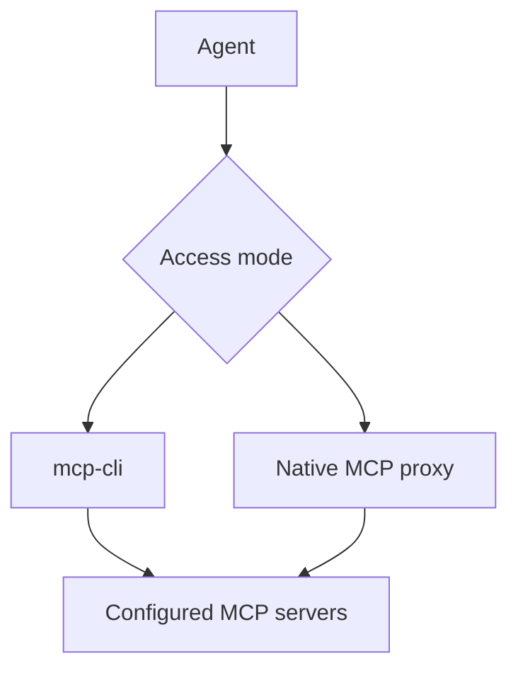

<div align="center">

# 🗜️ MCP Compression Proxy

### More MCP tools. Less context overhead.

Use a large MCP toolset without loading every tool into every prompt. MCP Compression Proxy is a local, open-source gateway with progressive discovery for shell-capable agents and one compatible endpoint for native MCP clients.

[![npm version][npm-version-badge]][npm-package]
[![npm downloads][npm-downloads-badge]][npm-package]
[![Node.js 22+][node-badge]][nodejs]
[![CI][ci-badge]][ci-workflow]
[![codecov][codecov-badge]][codecov]
[![License: MIT][license-badge]][license-file]

[🚀 Quick start](#-quick-start-progressive-discovery) · [🧭 Choose a mode](#-choose-a-mode) · [🔧 Configuration](#-configuration) · [💖 Support](#-support-the-project)

</div>

MCP Compression Proxy combines local stdio and remote Streamable HTTP servers behind one configuration. Agents can search for a tool, inspect its schema only when needed, and keep oversized results out of the conversation.

- 🔍 **Discover tools on demand** with `mcp-cli`.
- 🔌 **Connect through one MCP endpoint** when native MCP compatibility is required.
- 📦 **Keep large results local** and read only the relevant portions.
- 🎯 **Ask for only what you need** from a tool call: named fields, relevant items.
- ♻️ **Reuse warm backends** and refresh stale or unhealthy connections.
- 🏠 **Keep control local** without a hosted gateway or control plane.

> [!IMPORTANT]
> `mcp-cli` provides the largest context reduction because it defers full tool schemas until an agent requests one. Native proxy mode shortens tool descriptions, but MCP clients still receive each tool's input schema during discovery, unless you switch it to [lazy exposure](#lazy-tool-exposure).

## 🧭 Choose a mode

| Your client                   | Start with                  | Context behavior                                                                                                    |
| ----------------------------- | --------------------------- | ------------------------------------------------------------------------------------------------------------------- |
| ⌨️ Shell-capable coding agent | **`mcp-cli` (recommended)** | Search compact summaries, inspect one schema, then call the tool                                                    |
| 🔌 Native MCP client          | **`mcp-compression-proxy`** | Connect through one endpoint and use shorter descriptions; schemas remain exposed unless `toolExposure` is `"lazy"` |

Both modes use the same server configuration and support local stdio and remote Streamable HTTP backends.

## 🚀 Quick start: progressive discovery

Requires Node.js 22 or newer.

### 1. Install

```bash
npm install -g mcp-compression-proxy
```

The package installs two commands: `mcp-cli` for progressive discovery and `mcp-compression-proxy` for native MCP clients.

### 2. Add one MCP server

This macOS/Linux example gives the filesystem server access to `/tmp`:

```bash
mkdir -p "$HOME/.mcp-compression-proxy"
cat > "$HOME/.mcp-compression-proxy/servers.json" <<'JSON'
{
  "mcpServers": [
    {
      "name": "filesystem",
      "command": "npx",
      "args": ["-y", "@modelcontextprotocol/server-filesystem", "/tmp"]
    }
  ]
}
JSON
```

### 3. Find and call a tool

```bash
mcp-cli doctor
mcp-cli search file
mcp-cli info filesystem/list_directory
mcp-cli call filesystem/list_directory '{"path":"/tmp"}'
```

The daemon starts automatically on the first command and keeps backend connections warm. `doctor` validates the configuration and reports backend health.

### 4. Tell your agent how to use it

Install the bundled skill:

```bash
mcp-cli install-skill            # ~/.claude/skills/mcp-cli
mcp-cli install-skill --project  # ./.claude/skills/mcp-cli, to commit with a repo
mcp-cli install-skill --path DIR # any agent's skills directory
```

The skill teaches the agent the whole workflow - search, `info`, `call`, `--want`/`--where`, payloads, scripts - and costs one line of context until a task needs an MCP capability. Your agent then reaches every MCP server through shell commands, with no MCP connection of its own. Re-run after upgrading; a copy you have edited is only replaced with `--force`.

For an agent without skill support, add this to your project instructions or `AGENTS.md` instead:

```text
Use mcp-cli to access MCP tools. Search before choosing a tool, inspect its
schema before the first call, and read large outputs with `mcp-cli output`
instead of loading an entire payload into the conversation.
```

That is the complete progressive-discovery setup. Add more servers to the same `servers.json` file as needed.

> 🎉 **You're ready.** Your agent can now discover the right tool, load one schema, and call it without carrying the entire catalog through the conversation.

## 🔌 Native MCP client setup

Use this mode when a client expects to launch an MCP server directly. Add the proxy to the client's MCP configuration:

```json
{
  "mcpServers": {
    "compression-proxy": {
      "command": "mcp-compression-proxy",
      "env": {
        "LOG_LEVEL": "info"
      }
    }
  }
}
```

Restart the client after saving its configuration. The proxy loads backend definitions from `~/.mcp-compression-proxy/servers.json` and exposes their tools as `serverName__toolName`, such as `filesystem__read_file`.

### Compress descriptions

If the client supports [MCP sampling][mcp-sampling], ask it to call:

```text
mcp-compression-proxy__compress_via_sampling
```

The proxy asks the client's existing model to shorten a batch of descriptions and saves the results in `~/.mcp-compression-proxy/cache.json`. No separate model provider or API key is required. Sampling is deprecated in the 2026-07-28 MCP specification, so new clients may omit it.

If sampling is unavailable, configure a [compressor endpoint](#compressor-endpoint) and the same tool uses it instead; or use `mcp-compression-proxy__get_uncompressed_tools` and then `mcp-compression-proxy__cache_compressed_tools`. Updated backend descriptions are detected as stale and queued for compression again.

Check the result with `mcp-compression-proxy__audit_compression` (or `mcp-cli audit`): it lists compressed descriptions that now read more like another tool than their own, and tools that look duplicated across servers. `requeue: true` sends the flagged ones back for compression.

### Lazy tool exposure

Set `"toolExposure": "lazy"` to list a few discovery tools instead of every backend schema:

| Tool                                  | Does                                                        |
| ------------------------------------- | ----------------------------------------------------------- |
| `mcp-compression-proxy__search_tools` | Ranked search over every backend tool                       |
| `mcp-compression-proxy__get_tool`     | One tool's description, input schema and annotations        |
| `mcp-compression-proxy__call_tool`    | Call it, optionally with `want`/`where` to shape the result |
| `mcp-compression-proxy__suggest_tool` | Candidate tools, and a proposed call with the local model   |
| `mcp-compression-proxy__shape_output` | Shape a saved large output                                  |

`read_output`, `find_output`, `run_script` and `stats` stay listed. Tools matching `pinnedTools` (for example `"filesystem__read_file"`) are still listed directly, so frequent ones need no lookup. This is the `mcp-cli` flow over plain MCP, for clients that cannot run shell commands.

In the default full exposure, `call_tool` and `shape_output` are also listed, so any client can ask for a shaped result.

## 🧠 Where the context savings come from

| Access pattern   | Loaded before the task                                     | Loaded when a tool is selected             |
| ---------------- | ---------------------------------------------------------- | ------------------------------------------ |
| Eager MCP client | Every advertised name, description, and input schema       | Nothing additional                         |
| Native proxy     | Names, shorter cached descriptions, and every input schema | Full description on request                |
| Native, lazy     | A handful of discovery tools and any pinned tools          | The selected tool's description and schema |
| Progressive CLI  | A small command vocabulary and compact search results      | The selected tool's description and schema |

Exact savings depend on the number of servers, their schema sizes, and which tools a task uses. The project intentionally does not claim a universal percentage: measure the complete tool definitions in your own stack rather than description text alone.

## ✨ What it handles

- **One configuration:** Aggregate any number of local stdio and remote Streamable HTTP servers.
- **Progressive discovery:** Ranked search (BM25 over names and descriptions, optionally blended with a local model) and only the schema needed for the next call.
- **Shaped results:** `--want` a shape and `--where` a topic to get back only the fields and items you need, with the full output kept for checking.
- **Large-output control:** Store results above a configurable threshold in private local files, then search or page through them.
- **Warm, replaceable connections:** Reuse backend processes while draining old generations without interrupting active calls.
- **Authentication recovery:** Reconnect after configured authentication failures and retry only tools explicitly marked safe.
- **Declarative call chains:** Run dependent MCP calls with JSON Pointer references and no arbitrary shell or JavaScript execution.
- **Operational visibility:** Inspect live server state, connection age, active calls, retries, failures, and compression coverage.
- **Tool policy:** Exclude tools entirely (hidden and refused) or preserve selected original descriptions with case-insensitive wildcard patterns.
- **Optional local model:** Cactus Needle 3, run as a local subprocess, for search by meaning, call suggestions and text extraction. Nothing requires it.

## 🏗️ How it works



`mcp-cli` uses a local daemon so repeated commands are short IPC round trips. Native clients launch the stdio proxy and see one namespaced MCP tool catalog.

## ⌨️ CLI reference

| Command                                              | Purpose                                            |
| ---------------------------------------------------- | -------------------------------------------------- |
| `mcp-cli search <query> [--limit N]`                 | Ranked search over tool names and descriptions     |
| `mcp-cli info <server>/<tool>`                       | Load the full schema for one tool                  |
| `mcp-cli call <server>/<tool> '<json>'`              | Execute a tool                                     |
| `mcp-cli call ... --want '<shape>' --where '<text>'` | Execute a tool and return only what you asked for  |
| `mcp-cli suggest <request> [--run] [--limit N]`      | Candidate tools (default 5) and a proposed call    |
| `mcp-cli tools`                                      | List compact summaries for every available tool    |
| `mcp-cli output find <id> <query>`                   | Search a cached large output                       |
| `mcp-cli output read <id> [offset] [length\|all]`    | Read a bounded page or the remainder of an output  |
| `mcp-cli output shape <id> --want/--where ...`       | Shape a cached output                              |
| `mcp-cli script '<json>'`                            | Run a declarative sequence of calls                |
| `mcp-cli stats`                                      | Show server and compression statistics             |
| `mcp-cli compress [--limit N]`                       | Compress descriptions with the compressor endpoint |
| `mcp-cli audit [--requeue]`                          | Check compressions and find duplicate tools        |
| `mcp-cli describe next\|review\|apply\|revert`       | Compress or rewrite descriptions with your agent   |
| `mcp-cli install-skill [--project]`                  | Install the mcp-cli skill for your agent           |
| `mcp-cli search-quality`                             | How often search ranked the used tool first        |
| `mcp-cli doctor`                                     | Validate configuration and backend health          |
| `mcp-cli daemon status`                              | Show daemon and connection lifecycle state         |
| `mcp-cli daemon logs [-n N] [-f]`                    | Read or follow daemon logs                         |
| `mcp-cli daemon restart`                             | Restart the local daemon                           |

Pass call JSON on stdin when shell quoting becomes awkward:

```bash
echo '{"path":"/tmp/notes.md"}' | mcp-cli call filesystem/read_file
```

Pass `--no-auto-start` when a command should fail instead of starting the daemon.

### Large outputs

Tool results longer than 10,000 characters are stored under `~/.mcp-compression-proxy/payloads/` by default. The CLI returns a payload ID instead of flooding the agent's context:

```bash
mcp-cli output find <payload-id> "needle"
mcp-cli output read <payload-id> 0 10000
mcp-cli output read <payload-id> 10000 all
```

The payload directory is mode `0700` and payload files are mode `0600`. Up to 100 entries are retained by the running process; the oldest are evicted first.

### Return only what you need

`--want` describes the answer you expect; `--where` keeps the list items relevant to a topic:

```bash
mcp-cli call github/list_issues '{"owner":"o","repo":"r"}' \
  --want '{"items":[{"number":"integer","title":"string","user.login":"string?"}]}' \
  --where 'authentication' --limit 10
```

- Object keys are kept (matched ignoring case, `_` and `-`, or as a dotted path like `user.login`); a one-element list means "a list of these".
- Leaf types are `string`, `number`, `integer`, `boolean`, `object`, `array` or `any`; `open|closed` means one of those values; a trailing `?` makes a field optional.
- JSON output is projected with no model: nothing is invented, missing fields come back as `null` and are listed in `meta.missing`.
- `--where` ranks items by shared words, blended with meaning when the local model is configured, and keeps up to `--limit` (default 20). It can return nothing.
- Text output needs the local model to extract fields; those answers are labelled `model-extraction` with the model's confidence.
- The full output is always saved: `source.id` works with `output read`, `output find` and `output shape`.

Script steps accept the same `want`, `where` and `limit` fields; `$ref` references still see the full output.

### Suggest a call

```bash
mcp-cli suggest "list the open pull requests in octo/repo"
```

Returns the best-matching tools with their schemas, which saves an `info` round trip. With the local model it also proposes a tool and arguments. `--run` executes the proposal only when the tool declares `readOnlyHint`, the model's confidence is at least 0.9, every argument appears in the request, and there is exactly one call; otherwise it says why not. Treat a proposal as a draft: in testing the small model picked the wrong tool with high confidence.

### Declarative call chains

Scripts can run up to 20 sequential MCP calls. A later step may use a prior JSON value through an [RFC 6901 JSON Pointer](https://www.rfc-editor.org/rfc/rfc6901):

```json
{
  "steps": [
    {
      "id": "search",
      "server": "docs",
      "tool": "search",
      "arguments": { "query": "progressive discovery" }
    },
    {
      "id": "read",
      "server": "docs",
      "tool": "read",
      "arguments": {
        "url": { "$ref": "search#/results/0/url" }
      }
    }
  ]
}
```

Scripts stop on the first failed step unless that step sets `continueOnError`. References substitute exact values; they do not transform data.

## 🔧 Configuration

The proxy reads both of these files when present:

- `~/.mcp-compression-proxy/servers.json` for user-level servers and defaults.
- `./servers.json` for project-specific additions and overrides.

Servers and tool patterns from both files are combined. Project-level scalar settings override user-level settings. Configuration changes are watched and healthy backends remain connected when their definitions have not changed.

### Local and remote servers

Each server must define exactly one transport: `command` for local stdio or `url` for Streamable HTTP.

```json
{
  "mcpServers": [
    {
      "name": "filesystem",
      "command": "npx",
      "args": ["-y", "@modelcontextprotocol/server-filesystem", "/tmp"],
      "inheritEnv": false
    },
    {
      "name": "remote-docs",
      "url": "https://mcp.example.com/mcp",
      "headers": {
        "Authorization": "Bearer ${DOCS_TOKEN}"
      },
      "timeout": 30
    }
  ],
  "excludeTools": ["*__delete_*", "*__experimental*"],
  "noCompressTools": ["filesystem__write_file"],
  "cli": {
    "payloadThreshold": 10000,
    "autoStartDaemon": true,
    "daemonLogLevel": "info"
  }
}
```

Remote servers support static headers. The proxy does not perform an interactive OAuth redirect, so use bearer tokens or API-key headers supported by the remote endpoint.

Environment references work in `env` and `headers`:

| Syntax              | Result                                                     |
| ------------------- | ---------------------------------------------------------- |
| `${NAME}`           | Use `NAME`; warn and substitute an empty string when unset |
| `${NAME:-fallback}` | Use `NAME`, or `fallback` when unset or empty              |
| `$${NAME}`          | Preserve the literal text `${NAME}`                        |

Local servers inherit the proxy's environment by default. Set `inheritEnv` to `false` for transport-safe defaults only, or provide an array such as `["HOME", "PATH", "LANG"]`. Explicit values in a server's `env` object always win.

### Core options

| Option                        | Default      | Purpose                                                            |
| ----------------------------- | ------------ | ------------------------------------------------------------------ |
| `defaultTimeout`              | `30`         | Backend timeout in seconds; overridable per server                 |
| `excludeTools`                | `[]`         | Hide matching `server__tool` names and refuse calls to them        |
| `noCompressTools`             | `[]`         | Always show original descriptions for matching tools               |
| `compressionFallbackBehavior` | `"original"` | Show `"original"` or `"blank"` before compression exists           |
| `inheritEnv`                  | `true`       | Control which environment variables local servers receive          |
| `softMaxConnectionAgeSeconds` | `3600`       | Lazily replace a connection on its next use after this age         |
| `hardMaxConnectionAgeSeconds` | `28800`      | Drain a connection at this age and reopen it on demand             |
| `authErrorPatterns`           | `[]`         | Identify authentication failures in errors or tool results         |
| `authRetryTools`              | `[]`         | Name tools safe to retry once after authentication recovery        |
| `cli.payloadThreshold`        | `10000`      | Store larger outputs in private local files                        |
| `cli.autoStartDaemon`         | `true`       | Start the daemon when a CLI command needs it                       |
| `cli.daemonLogLevel`          | `"info"`     | Set `debug`, `info`, `warn`, or `error` logging                    |
| `toolExposure`                | `"full"`     | `"lazy"` lists discovery tools instead of every schema             |
| `pinnedTools`                 | `[]`         | Tools still listed directly in lazy exposure                       |
| `search.limit`                | `15`         | Results returned by search                                         |
| `search.learnFromUsage`       | `false`      | Record which result was used, to rank it higher next time          |
| `model`                       | none         | Optional [local model](#-optional-local-model)                     |
| `compressor`                  | none         | [OpenAI-compatible endpoint](#compressor-endpoint) for compression |

Set either connection age to `0` to disable that policy. Lifecycle and authentication options may also be set per server. Authentication failures always replace the backend generation that produced them, but automatic replay occurs only for names matching `authRetryTools`.

See [`servers.json.example`](servers.json.example) for a complete starting point.

`model` settings are read at startup; after changing them run `mcp-cli daemon restart`, or restart the MCP client for the native proxy.

### Search learning

With `"search": { "learnFromUsage": true }`, a search followed by `info` or `call` on one of its results is recorded in `~/.mcp-compression-proxy/search-usage.jsonl` (owner-only, last 5,000 choices). Tools chosen for queries with the same words rank higher, and `mcp-cli search-quality` reports how often the used tool was ranked first, in the top five, or not shown at all: real numbers for your own tool set. The native proxy and the `mcp-cli` daemon share the file, so a choice made through either one counts for both.

### Improve descriptions with your own agent

Many servers ship vague or missing descriptions. With the skill installed, ask your agent to "rewrite the MCP tool descriptions" (or "compress" them): it uses the model you already run, with no API key and no extra model.

```bash
mcp-cli describe next --mode rewrite --limit 10   # tools needing work, weakest first, as JSON
mcp-cli describe review proposals.json            # before/after and checks; saves nothing
mcp-cli describe apply proposals.json             # saves only what passed, after you approve
mcp-cli describe revert <server>/<tool>           # or --all
```

- `next` gives each tool's original description, parameters, why it needs work, and similar tools it must be told apart from.
- `rewrite` may improve parameter descriptions too; names, types and required fields never change. `compress` must end up shorter.
- `review` rejects unknown tools or parameters, over-long text, and a description that reads clearly more like another tool than its own.
- The server's original is always kept. A tool whose server later changes its description is offered again.

The skill's instructions have the agent ask before starting and show you the review before applying.

### Compressor endpoint

Any OpenAI-compatible `/chat/completions` endpoint can write compressed descriptions when the MCP client cannot lend its model through sampling (deprecated in the 2026-07-28 MCP specification):

```json
{
  "compressor": {
    "url": "http://localhost:11434/v1",
    "model": "llama3.2",
    "apiKey": "${COMPRESSOR_API_KEY:-}"
  }
}
```

Run `mcp-cli compress` repeatedly until nothing remains, or call `mcp-compression-proxy__compress_via_sampling` from a native client. Only tool names and descriptions are sent to the endpoint.

A project `servers.json` with its own `compressor` replaces the user-level one. It inherits the user's `apiKey` and `headers` only when both name the same `url`, so a repository's config cannot redirect your key to another endpoint.

## 🧩 Optional local model

A local [Cactus Needle 3](https://github.com/cactus-compute/needle) model (29-121M parameters, 8-29 MB) adds meaning-based ranking to search and `--where`, proposed calls in `suggest`, and field extraction from text output. Every feature works without it.

```bash
python3 -m venv ~/.mcp-compression-proxy/needle
~/.mcp-compression-proxy/needle/bin/pip install cactus-needle
```

```json
{
  "model": {
    "provider": "needle",
    "command": "/home/you/.mcp-compression-proxy/needle/bin/python"
  }
}
```

The proxy starts its bundled `needle_bridge.py` with that interpreter on first use, keeps it idle-unreferenced, and stops it after `idleTimeout` seconds (default 600). The first start downloads about 35 MB of weights from Hugging Face; after that it runs offline. Needle's usage telemetry is always switched off. Tool embeddings are cached in `~/.mcp-compression-proxy/embeddings.json`, and rebuilt in the background when `command`, `args` or `env` change, since vectors from different weights cannot be compared.

What to expect, measured on a 43-tool catalog with 30 labelled queries (`tests/fixtures/search-catalog.ts`):

| Search                   | Right tool first | Right tool in top five |
| ------------------------ | ---------------- | ---------------------- |
| Previous substring match | 2 / 30           | 2 / 30                 |
| BM25, no model           | 17 / 30          | 23 / 30                |
| BM25 + Needle similarity | 15 / 30          | 26 / 30                |

The model finds paraphrases that share no word with the tool ("remember a fact about a person") at a small cost to first place. Its call proposals and its confidence are less reliable: it chose wrong tools while reporting 0.95-1.0, which is why `suggest --run` requires `readOnlyHint` and grounded arguments as well. `model.confirmAuthFailures` (opt-in) asks it whether a long result matching an auth error pattern is really a failure; the base weights were not accurate enough for that to change anything in testing, so it is meant for fine-tuned weights (`model.args` can point the bridge at them).

<details>
<summary><strong>🚦 Versioned daemon deployments</strong></summary>

The daemon exposes a contract for a separate stable router to run candidate and active releases on different sockets. Configure each instance with `MCP_DAEMON_SOCKET_PATH`, `MCP_DAEMON_PID_FILE`, `MCP_DAEMON_READY_FILE`, `MCP_DAEMON_LOG_FILE`, and `MCP_DAEMON_RELEASE_ID`.

`MCP_DAEMON_BASE_DIR` selects the shared state root, while `MCP_PAYLOAD_DIR` can preserve payload IDs across a release cutover. When `active-release.json` exists in that root, `mcp-cli` treats the installation as router-managed and refuses to start a legacy daemon on the stable socket.

This allows an external router to canary a candidate, switch new requests atomically, drain calls pinned to the old release, and roll back without terminating in-flight work.

</details>

## 🛡️ Security and privacy

- The proxy runs locally and does not require a hosted control plane.
- Tool inputs and outputs go only to the backend servers you configure; remote backends naturally receive calls addressed to them.
- Large outputs are stored in owner-only files and are retrieved by opaque payload ID, not arbitrary path. Shaped calls store the full output the same way.
- Tools matching `excludeTools` are refused on every call path, not only hidden from listings.
- The optional local model runs as a local subprocess with its telemetry disabled; tool data sent to it stays on the machine. A `compressor` endpoint receives tool names and descriptions only, never tool inputs or outputs.
- Search learning is off by default; when enabled, queries and chosen tool names are kept in an owner-only local file.
- The daemon's local control socket can execute downstream MCP tools and is kept inside an owner-only directory.
- Use `inheritEnv: false` or an allowlist when a third-party local server should not receive unrelated environment variables.
- MCP Compression Proxy is a transport and lifecycle layer, not a sandbox or authorization boundary. Apply normal trust and permission controls to every backend server.

See [SECURITY.md][security] to report a vulnerability.

## 🩺 Troubleshooting

Start with:

```bash
mcp-cli doctor
mcp-cli daemon status
mcp-cli daemon logs -n 100
```

- After changing daemon-specific settings, run `mcp-cli daemon restart`.
- Clear saved descriptions with `mcp-compression-proxy --clear-cache`.
- Native MCP logs go to stderr so stdout remains valid JSON-RPC.
- A restricted agent sandbox may block the daemon's Unix socket. Grant access to `~/.mcp-compression-proxy/` or run the CLI in the host environment.
- If `suggest` reports "Local model unavailable", or search never uses the model, the daemon log shows why; usually `cactus-needle` is not installed for the interpreter named in `model.command`.

## 🤝 Contributing

Found a bug 🐛, have an idea ✨, or want to improve the docs? Contributions are welcome. Read [CONTRIBUTING.md][contributing], follow the [Code of Conduct][code-of-conduct], and run the checks before opening a pull request:

```bash
npm install
npm run typecheck
npm run lint
npm test
```

Additional test guidance is in [`tests/README.md`](tests/README.md).

## 💖 Support the project

Open source grows through the people who try it, share it, and improve it. If MCP Compression Proxy gives your agent some breathing room:

- ⭐ **[Star the repository][stargazers]** so more MCP users can discover it.
- 🐛 **[Report a bug or suggest an idea][repo-issues]** to help shape the roadmap.
- 📝 **[Contribute code or documentation][contributing]**—first-time contributors are welcome.
- 💖 **Sponsor continued development** using any of the options below.

<div align="center">

[![GitHub Stars][stars-badge]][stargazers]
[![Sponsor on GitHub][sponsor-github-badge]][sponsor-github]
[![Buy Me a Coffee][sponsor-coffee-badge]][sponsor-coffee]
[![PayPal][sponsor-paypal-badge]][sponsor-paypal]

**Every star, issue, pull request, and contribution helps. Thank you! 🙌**

</div>

## 📄 License

[MIT](LICENSE) © 2025 KDPA. Built with the [Model Context Protocol TypeScript SDK][mcp-sdk].

---

<div align="center">

[⬆ Back to top](#-mcp-compression-proxy)

Made with ❤️ by KDPA

</div>

<!-- Reference links -->

[npm-version-badge]: https://img.shields.io/npm/v/mcp-compression-proxy.svg
[npm-package]: https://www.npmjs.com/package/mcp-compression-proxy
[npm-downloads-badge]: https://img.shields.io/npm/dm/mcp-compression-proxy
[node-badge]: https://img.shields.io/badge/node-%3E%3D22.0.0-brightgreen.svg
[nodejs]: https://nodejs.org/
[ci-badge]: https://github.com/kdpa-llc/mcp-compression-proxy/actions/workflows/test.yml/badge.svg
[ci-workflow]: https://github.com/kdpa-llc/mcp-compression-proxy/actions/workflows/test.yml
[codecov-badge]: https://codecov.io/gh/kdpa-llc/mcp-compression-proxy/branch/main/graph/badge.svg
[codecov]: https://codecov.io/gh/kdpa-llc/mcp-compression-proxy
[license-badge]: https://img.shields.io/badge/License-MIT-yellow.svg
[license-file]: LICENSE
[repo]: https://github.com/kdpa-llc/mcp-compression-proxy
[stars-badge]: https://img.shields.io/github/stars/kdpa-llc/mcp-compression-proxy?style=social
[stargazers]: https://github.com/kdpa-llc/mcp-compression-proxy/stargazers
[repo-issues]: https://github.com/kdpa-llc/mcp-compression-proxy/issues
[contributing]: CONTRIBUTING.md
[security]: SECURITY.md
[code-of-conduct]: CODE_OF_CONDUCT.md
[sponsor-github-badge]: https://img.shields.io/badge/Sponsor-GitHub%20Sponsors-ea4aaa?logo=github
[sponsor-github]: https://github.com/sponsors/moscaverd
[sponsor-coffee-badge]: https://img.shields.io/badge/Buy%20Me%20a%20Coffee-support-yellow?logo=buy-me-a-coffee
[sponsor-coffee]: https://buymeacoffee.com/moscaverd
[sponsor-paypal-badge]: https://img.shields.io/badge/PayPal-donate-blue?logo=paypal
[sponsor-paypal]: https://paypal.me/moscaverd
[mcp-sdk]: https://github.com/modelcontextprotocol/typescript-sdk
[mcp-sampling]: https://modelcontextprotocol.io/specification/2026-07-28/client/sampling
